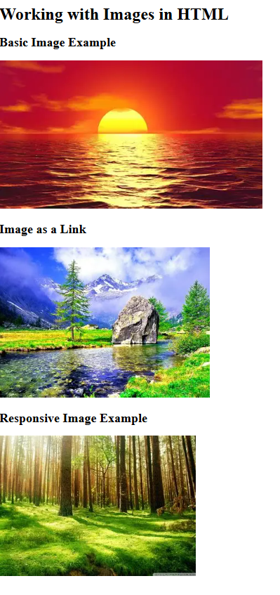

# HTML Images Lesson

This page demonstrates how to use images in HTML, including:
- Adding a basic image with `src` and `alt` attributes.
- Making an image clickable using an anchor tag.
- Creating a responsive image using CSS styling.

---

## 🌐 Live Demo

---

## 🖼 Screenshot Preview

---

## 📂 Project Structure
